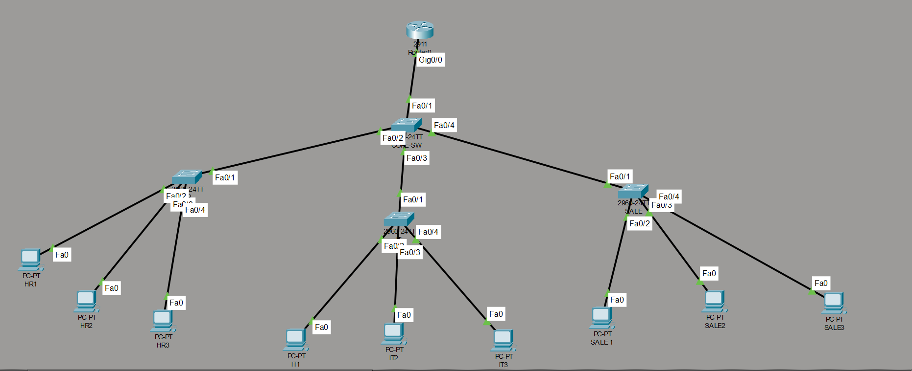
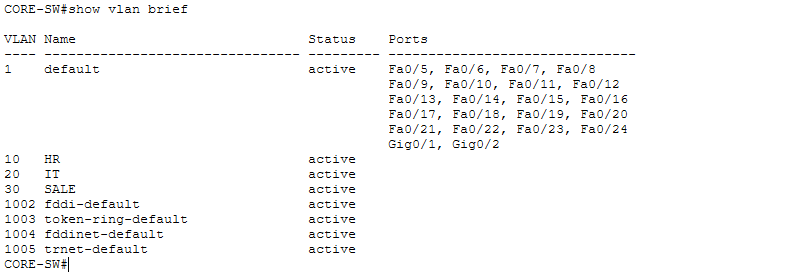
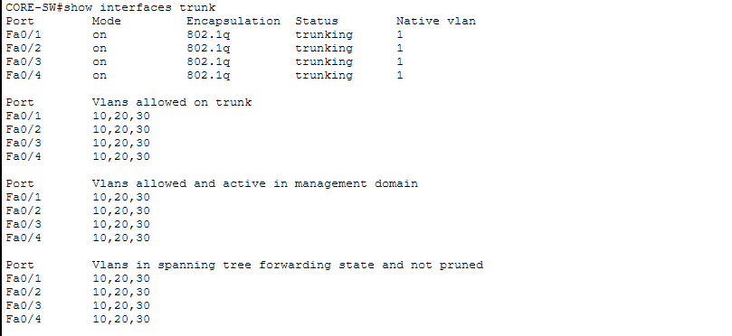
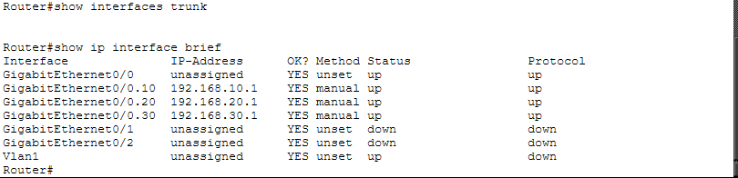
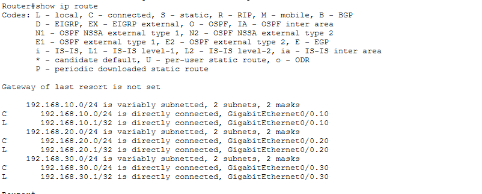
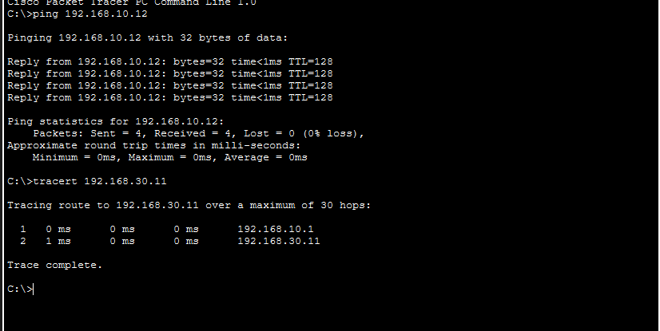

---

---


---

# 📖 Overview

This project simulates a small enterprise office network using **Cisco Packet Tracer**.

The network consists of three departments:

- Human Resources (HR)
- Information Technology (IT)
- Sales

Each department is isolated using VLAN technology while communication between departments is enabled through **Router-on-a-Stick Inter-VLAN Routing**.

---

# 🎯 Objectives

- Design a small enterprise office network.
- Implement VLAN segmentation.
- Configure IEEE 802.1Q trunk links.
- Configure Router-on-a-Stick.
- Enable Inter-VLAN Routing.
- Verify end-to-end network connectivity.

---

# 🖥️ Network Topology




---

# 🏗️ Network Architecture

```
                    R1
                     │
                802.1Q Trunk
                     │
                 CORE-SW
          ┌──────────┼──────────┐
          │          │          │
       HR-SW      IT-SW     SALES-SW
          │          │          │
      HR-PCs     IT-PCs    SALES-PCs
```

---

# 🌐 VLAN Design

| Department | VLAN    | Network         | Default Gateway |
| ---------- | ------- | --------------- | --------------- |
| HR         | VLAN 10 | 192.168.10.0/24 | 192.168.10.1    |
| IT         | VLAN 20 | 192.168.20.0/24 | 192.168.20.1    |
| Sales      | VLAN 30 | 192.168.30.0/24 | 192.168.30.1    |

---

# 🛠️ Technologies Used

- Cisco Packet Tracer
- Cisco IOS
- IPv4 Addressing
- VLAN
- IEEE 802.1Q Trunking
- Router-on-a-Stick
- Inter-VLAN Routing

---

# ✨ Features

- VLAN Configuration
- Access Port Configuration
- Trunk Port Configuration
- Router-on-a-Stick
- Inter-VLAN Routing
- Static IPv4 Addressing
- Network Connectivity Verification

---

# ⚙️ Router Configuration

The router was configured using **Router-on-a-Stick** with three subinterfaces.

| Interface | VLAN | IP Address   |
| --------- | ---- | ------------ |
| G0/0.10   | 10   | 192.168.10.1 |
| G0/0.20   | 20   | 192.168.20.1 |
| G0/0.30   | 30   | 192.168.30.1 |

Each subinterface acts as the default gateway for its corresponding VLAN.

---

# ✅ Verification

## VLAN Configuration

Command

```bash
show vlan brief
```



---

## Trunk Configuration

Command

```bash
show interfaces trunk
```



---

## Router Interface Status

Command

```bash
show ip interface brief
```



---

## Routing Table

Command

```bash
show ip route
```



---

## Network Connectivity Verification

The network connectivity was successfully verified using **Ping** and **Traceroute**.

### Commands

```cmd
ping 192.168.10.12

tracert 192.168.30.11
```

### Result



The verification confirms that:

- VLAN communication is functioning correctly.
- Inter-VLAN Routing is operational.
- Packets are forwarded through the Router-on-a-Stick gateway.
- End-to-end network connectivity is successfully established.

---

# 📂 Project Structure

```
Enterprise-Office-Network
│
├── Enterprise-Office-Network.pkt
├── README.md
│
├── configs
│   ├── R1.txt
│   ├── CORE-SW.txt
│   ├── HR-SW.txt
│   ├── IT-SW.txt
│   └── SALES-SW.txt
│
├── screenshots
│   ├── topology.png
│   ├── show-vlan-brief.png
│   ├── show-trunk.png
│   ├── show-ip-interface-brief.png
│   ├── show-ip-route.png
│   └── network-connectivity-test.png
│
└── report.pdf
```

---

# 📚 Learning Outcomes

Through this project, I gained practical experience in:

- Enterprise Network Design
- VLAN Segmentation
- IEEE 802.1Q Trunking
- Router-on-a-Stick
- Inter-VLAN Routing
- Cisco IOS Configuration
- Network Verification and Troubleshooting

---

# 🚀 Future Improvements

The next version of this project will include:

- DHCP Server
- Access Control Lists (ACL)
- SSH Remote Management
- NAT/PAT
- OSPF Dynamic Routing
- Branch Office Connectivity
- Enterprise WAN Design

---

# 👨‍💻 Author

**Pham Quyen**

Bachelor of Information Technology

Ho Chi Minh City University of Transport (UTH)

GitHub: https://github.com/your-github
